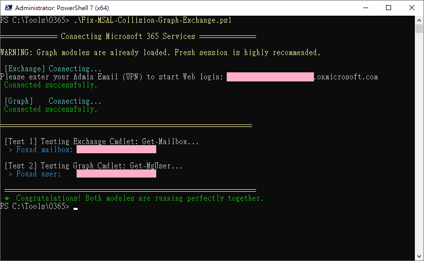

# Fix MSAL DLL Collision: Microsoft Graph & Exchange Online PowerShell 🚀

  **ultimate, robust workaround** for the widespread MSAL DLL Version Collisions and WAM `RuntimeBroker` `NullReferenceException` crashes when mixing `Microsoft.Graph` 和 `ExchangeOnlineManagement` (v3.4+) modules in the same PowerShell session.

This repository provides a clean, copy-pasteable script that perfectly side-steps all k現在n Microsoft MSAL identity bugs, fully supporting MFA-enforced tenants without throwing errors.

## 💥 The Problem(s)

If you've ever tried to script automating both Microsoft 365 Exchange and Entra ID (Graph) together, you've likely hit one of these fatal walls:

1. **The Classic MSAL DLL Collision (PowerShell 5.1)**
   Because Windows PowerShell 5.1 runs a single AppDomain, whichever module you load first locks its version of `Microsoft.Identity.Client.dll` into memory. When the second module loads, it violently crashes with `Method not found: '... WithBroker ...'` 或 `CouldNotAutoloadMatchingModule`。
   
2. **The WAM Broker `NullReferenceException` (PowerShell 7)**
   If you migrate to PowerShell 7 to utilize `.NET Core AssemblyLoadContext` (which correctly isolates the conflicting DLLs), `ExchangeOnlineManagement` V3.4+ introduces a highly-flawed native Web Account Manager (WAM) integration.
   If you pass silent credentials (`-Credential`) into `Connect-ExchangeOnline` in an environment without a full UI handle, the WAM `RuntimeBroker` throws an immediate, uncatchable `System.NullReferenceException: Object reference not set to an instance of an object`。
   
3. **The WAM OS Picker Redirect URI Bug (`AADSTS1400011`)**
   If you try to run the flow interactively in PS7 without specifying an account, the Windows 11 OS native Account Picker (AadBrokerPlugin) catches the auth request but crashes internally when throwing the token back, because Microsoft misconfigured the first-party Exchange PowerShell app's redirect URI (`ms-appx-web://microsoft.aad.brokerplugin/...`).

## 💡 The Ultimate Fix (How this script works)

This script implements a foolproof "**Golden Path**" authentication sequence:

1. **Force PowerShell 7 (`pwsh.exe`)**: We ditch PS5.1 entirely so AssemblyLoadContext can isolate both modules' DLL versions perfectly.
2. **Strict Load Order**: We `Import-Module ExchangeOnlineManagement` heavily **BEFORE** Graph, mitigating any leftover environment variable locks (`.WithBroker()`) caused by Graph's backend.
3. **  `-UserPrincipalName` Escape Hatch**: We completely remove the legacy `-Credential` parameter, thus avoiding the PS7 `NullReferenceException` ROPC crash. By dynamically requesting your email and passing it via `-UserPrincipalName $upn`, we intentionally skip the natively bugged Windows WAM OS Picker (the origin of `AADSTS1400011`). Microsoft's library sees the UPN, gracefully falls back to the clean, standard web browser popup loopback, and completes the login perfectly (supporting native MFA/Authenticator App triggers)!

## 🛠️ Usage

1. Download or clone this repository.
2. Open **PowerShell 7** (`pwsh.exe`). If you don't have it, install it via:
   ```powershell
   winget install Microsoft.PowerShell
   ```
3. Run the script:
   ```powershell
   .\Fix-MSAL-Collision-Graph-Exchange.ps1
   ```
4. A prompt will ask for your Admin Email (UPN). Enter it.
5. Standard Microsoft browser login windows will open securely. Complete your MFA as usual.
6. Done! Both modules will be connected flawlessly in the same session.

## 📸 Demo



## 🛡️ Privacy & Safety
The test script automatically **masks your email addresses (`***@***.com`)** in its final output testing block.

---
*Inspired by the frustrating but rewarding debugging trails discussed in Graph PowerShell GitHub Issues [#3331](https://github.com/microsoftgraph/msgraph-sdk-powershell/issues/3331) 和 [#3394](https://github.com/microsoftgraph/msgraph-sdk-powershell/issues/3394)。*
